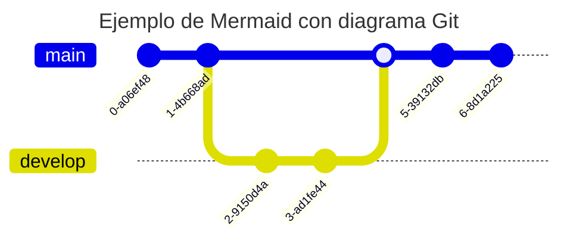

#  Hola, soy Jordi Ros.

## Acabo de descubrir Mermaid y me flipa!!

Este código: 
~~~
title: Ejemplo de Mermaid con diagrama Git
gitGraph
   commit
   commit
   branch develop
   checkout develop
   commit
   commit
   checkout main
   merge develop
   commit
   commit
~~~

..te genera esto;

### Aquí su [Github] y aquí su [web] con toda la documentación y tutoriales.
[Github]:https://github.com/mermaid-js/mermaid
[web]:https://mermaid.js.org
